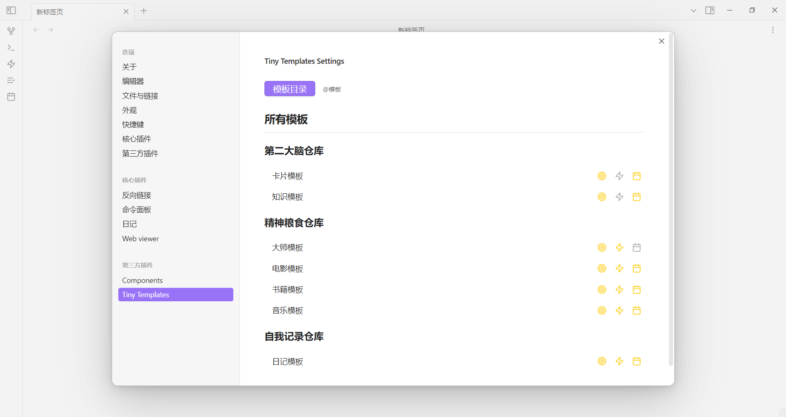
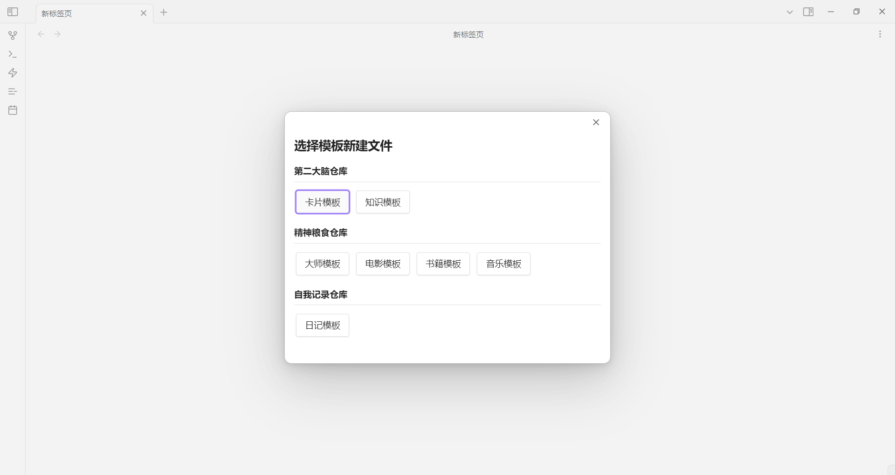

# Tiny Templates 插件

Tiny Templates 是一个轻量级的 Obsidian 模板管理插件，让您能够快速从模板创建新笔记，并支持自动填充日期、设置预设标题格式等功能。

## 界面预览

## 主要功能

- 📝 **快速创建笔记**：从模板快速创建新的笔记文件
- 📂 **目标目录设置**：为每个模板指定默认的创建目录
- 🏷️ **预设标题格式**：支持使用日期变量创建预设的文件标题格式
- ⚡ **命令快速访问**：将常用模板添加到命令面板，支持设置快捷键
- 📅 **日期字段自动填充**：新建文件时自动填充日期相关的 frontmatter 字段

## 使用方法

### 基本设置

1. 安装并启用插件后，进入设置页面
2. 设置模板目录：选择存放模板文件的文件夹
3. 为每个模板配置：
   - 目标目录：创建文件的默认位置
   - 预设标题格式：使用变量设置文件名格式
   - 是否添加到命令面板
   - 日期字段自动填充规则

### 创建新文件

1. 使用热键打开模板选择弹窗
2. 使用方向键或鼠标选择模板
3. 按 Enter 或点击模板即可创建新文件

## 预设标题格式

支持使用以下日期变量来动态生成文件名：

- `{{date}}`: 当前日期（YYYY-MM-DD格式）
- `{{year}}`: 年份（YYYY格式）
- `{{quarter}}`: 季度（1-4）
- `{{month}}`: 月份（MM格式）
- `{{week}}`: 周数（1-52）
- `{{weekday}}`: 星期（一、二、三、四、五、六、日）
- `{{day}}`: 日（DD格式）

例如，设置标题格式为 `日记@{{date}}-星期{{weekday}}`，则创建的文件名类似：`日记@2025-03-08-星期五.md`

## 键盘导航

在模板选择弹窗中，可以使用键盘快速导航：

- **左右箭头**：按顺序切换卡片。到达分类尾部时会进入下一个分类的第一个模板，到达分类头部时会进入上一个分类的最后一个模板。
- **上下箭头**：在不同分类间切换。尽量保持相同的模板位置。
- **Enter**：使用当前选择的模板创建文件。

## 安装方法

1. 下载最新的 release
2. 解压缩到您的 Obsidian vault 的 `.obsidian/plugins/` 目录下
3. 重启 Obsidian
4. 在设置中启用插件
