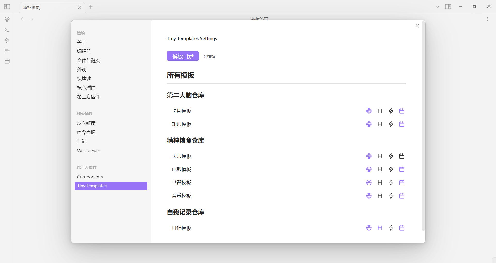

# Tiny Templates 插件

Quickly add files to your vault via templates.

## 功能特点

1. 模板分类管理
   - 支持通过文件夹自动对模板进行分类
   - 根目录下的模板自动归类为"未分类"
   - 支持多级目录分类

2. 快速创建文件
   - 支持从命令面板快速创建文件
   - 支持通过弹窗选择模板创建文件
   - 自动在新标签页打开创建的文件

3. 灵活的目标目录设置
   - 为每个模板单独设置目标目录
   - 支持搜索和选择任意目录
   - 直观的目录选择界面

4. 日期字段自动填充
   - 支持自定义需要自动填充日期的字段
   - 创建文件时自动填入当天日期
   - 适用于任何前置元数据字段

5. 命令面板集成
   - 可将常用模板添加到命令面板
   - 支持为模板命令设置快捷键
   - 随时可以取消注册命令

## 使用方法

### 1. 基础设置

1. 点击设置页面中的"模板目录"按钮
2. 选择存放模板的根目录
3. 插件会自动扫描该目录下的所有 Markdown 文件

### 2. 模板管理

- **分类方式**：
  - 直接放在模板根目录下的文件为未分类模板
  - 放在子文件夹中的文件会自动按文件夹分类
  - 支持多层文件夹嵌套

- **模板设置**：
  每个模板有三个设置选项：
  1. 🎯 设置目标目录（保存新建文件的位置）
  2. ⚡ 添加到命令面板（可设置快捷键）
  3. 📅 配置日期字段（自动填充当天日期）

### 3. 创建文件

两种方式可以创建文件：

1. **通过弹窗选择**
   - 点击左侧栏的⚡图标
   - 在弹窗中选择模板
   - 支持键盘导航：
     - ↑↓：在分类间切换
     - ←→：在同一分类的模板间切换
     - Enter：使用选中的模板创建文件

2. **通过命令面板**
   - 为常用模板添加到命令面板
   - 可以设置快捷键
   - 直接使用命令或快捷键创建文件

### 4. 日期字段设置

1. 点击模板设置中的📅图标
2. 在弹出的窗口中选择需要自动填充日期的字段
3. 创建文件时，选中的字段会自动填入当天日期（YYYY-MM-DD格式）

## 注意事项

1. 使用模板前必须先设置目标目录
2. 模板必须是 Markdown 文件（.md后缀）
3. 日期字段必须在模板的前置元数据中定义
4. 添加到命令面板的模板可以随时取消注册

## 键盘快捷键

- **模板选择弹窗**：
  - `↑` `↓`：切换分类
  - `←` `→`：切换模板
  - `Enter`：使用选中的模板
  
- **命令面板**：
  - 可为每个添加到命令面板的模板设置自定义快捷键
